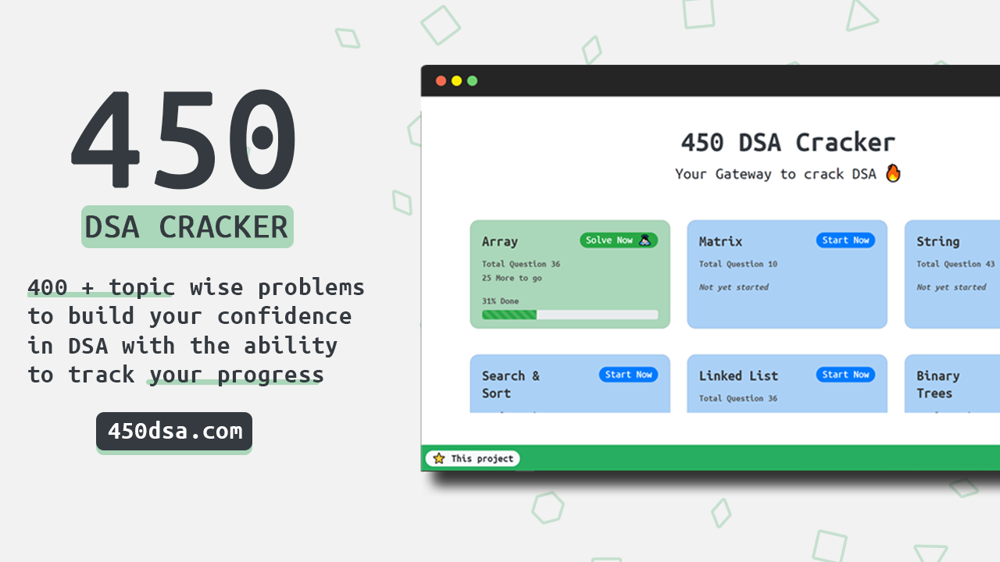

# DSA-450 Tracker 🚀

## Overview 👀

<!--  -->

- **Topic wise question search**
- **Topic wise progress**
- **Complete local storage**
## What is DSA-450 Tracker 🤔

#### DSA 450  Tracker is a comprehensive list of 400 + topic wise questions to build your confidence in data structure and algorithms and prepare yourself for placements.

#### DSA 450 Tracker doesn't guarantee a job but guarantees your confidence in solving any coding problem if done in the right way 👍🏻.
## Dependencies 🗃

- [React] - **Frontend Framework**
- [Bootstrap] - **CSS Framework**
- [React-Reveal] - **React Based Animations**
- [React-Table-2] - **Suite of table hooks**
- [LocalBase] - **Firebase style DB for offline storage**

